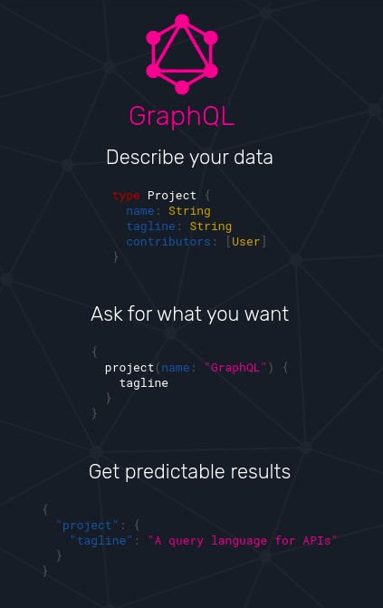
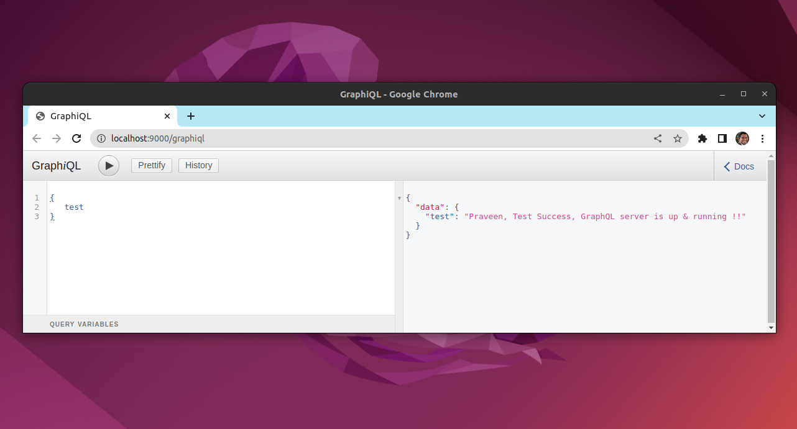
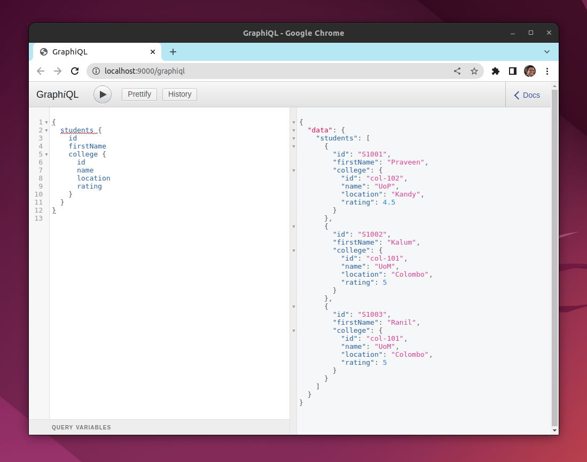
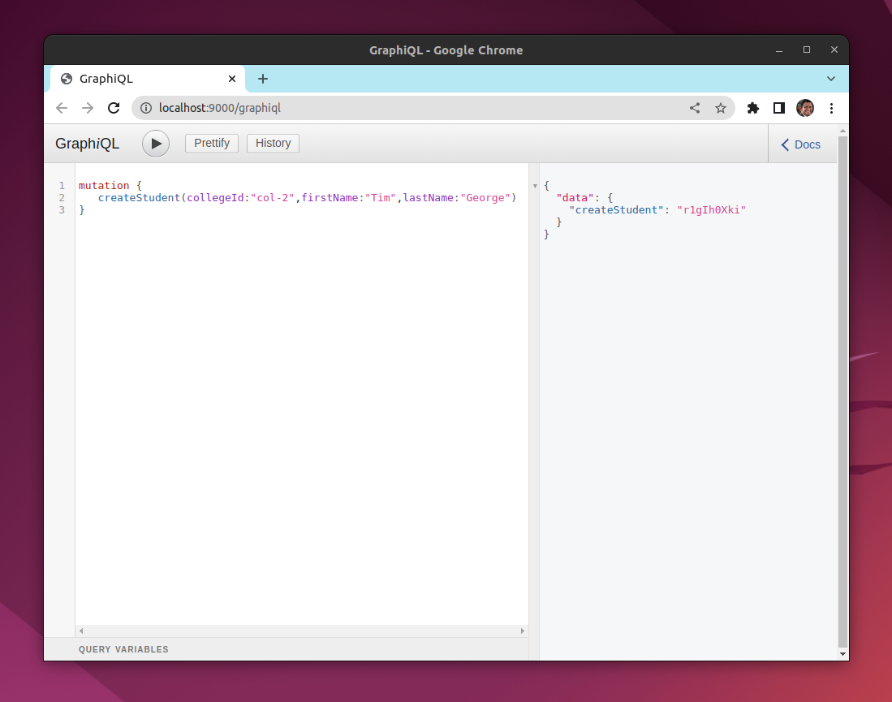

# GraphQL

GraphQL is a query language for your API, and a server-side runtime for executing queries using a type system you define for your data.

https://graphql.org/

# test GraphQL

# Nested Queries

# GraphQL Mutations

